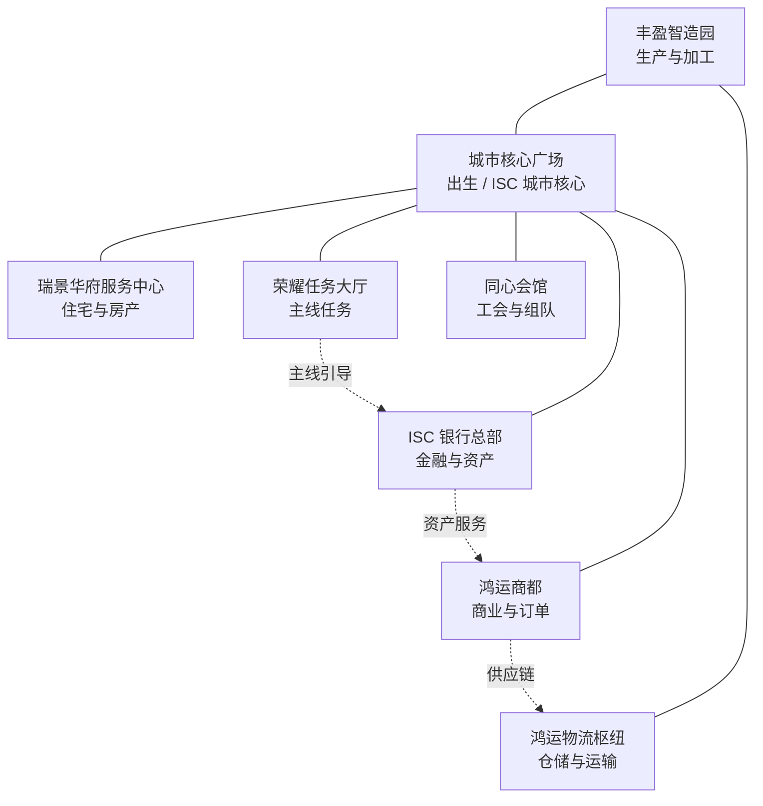

# Ice Snow City 基础地标建筑 3D 模型设计与 Babylon.js 布局方案

**版本**：2026-09-03  
**适用阶段**：MVP 灰盒 → 首批可玩城市 → GLB/PBR 资产替换  
**目标画幅**：移动端横屏 16:9，兼容桌面端预览  
**视觉方向**：3D 半写实卡通、冰雪现代都市、冷色主导与金色功能强调

## 一、方案结论

当前农业 3D 场景可以作为技术验证区，但还不能承担完整商业帝国的出生、导航和功能承载职责。本方案将初始城市组织为一个“城市核心 + 五个功能区”的可玩地图。城市核心负责出生和新手引导，金融区承载银行与 ISC 资产服务，商业区承载商品与 NFT 订单，住宅区承载玩家房产，生产区承载建筑收益和供应链，公共/社交区承载任务、NPC、工会和组队。

第一阶段不等待真实 GLB 文件即可使用 Babylon 程序化几何完成灰盒和交互验证；第二阶段按同一节点命名、碰撞体和元数据契约替换为美术导出的 glTF 2.0/GLB。这样不会把临时模型误当成最终资产，也不会阻塞出生、探索、点击和任务流程。

## 二、初始地标建筑清单

| 地标 ID | 显示名称 | 所属区域 | 核心功能 | MVP 优先级 | 建议最终面数 |
|---|---|---|---|---|---:|
| `landmark-city-core` | 城市核心广场 | 城市核心 | 出生点、主线任务、公告、全局导航 | P0 | 8k–12k |
| `landmark-isc-bank` | ISC 银行总部 | 金融区 | 余额、存取款、利息、资产管理 | P0 | 8k–14k |
| `landmark-central-market` | 中央商业中心 | 商业区 | 商品交易、订单、NFT 市场入口 | P0 | 10k–15k |
| `landmark-residential-service` | 瑞景华府服务中心 | 住宅区 | 房产、住宅升级、装饰与入住 | P1 | 6k–10k |
| `landmark-production-hub` | 丰盈智造园 | 生产区 | 建设、生产、加工、收益 | P0 | 10k–15k |
| `landmark-quest-hall` | 荣耀任务大厅 | 公共/社交区 | 主线任务、每日任务、任务 NPC | P0 | 7k–12k |
| `landmark-guild-hall` | 同心会馆 | 公共/社交区 | 工会、组队、好友和公共频道 | P1 | 7k–12k |
| `landmark-logistics-terminal` | 鸿运物流枢纽 | 生产区边缘 | 运输、仓储、供应链和批量收益 | P1 | 6k–10k |

“瑞景华府”和“丰盈智造园”沿用当前测试对象的吉祥命名；它们在正式版本中应从测试地块升级为可进入的功能地标。“鸿运商都”可以作为商业区的品牌名，而中央商业中心作为系统功能名，避免 UI 和世界地标混淆。

## 三、单体模型设计规范

### 3.1 城市核心广场

城市核心广场应采用环形平台、中央 ISC 雪花标志、低矮水晶纪念碑和四条放射道路。中央标志必须使用项目统一 ISC Logo 的几何轮廓或合法贴图版本，不再为不同场景单独绘制雪花图案。模型重点不是高楼，而是让玩家登录后立即理解“这里是出生点、导航点和城市总览点”。

灰盒阶段由圆形平台、四条道路、中央柱体、四个导视牌和六个低矮装饰体组成。正式资产阶段加入可开合的城市核心门廊、动态屏幕、夜间边缘灯和轻量雪粒子。建议设置不可穿越的中心装饰碰撞体，并将环形道路保持为可行走区域。

### 3.2 ISC 银行总部

银行总部采用对称的现代金融建筑：下部为深蓝石材基座，中部为冰晶玻璃大厅，上部为带金色 ISC 标识的悬浮冠顶。入口应明显朝向城市核心，门前保留 12–16 米宽的交互前场，让玩家能够看到银行 NPC 和功能提示。

银行模型需要预留三个可交互节点：入口门、服务柜台和数字资产展示墙。功能面板不应依赖玩家走入真实室内，点击建筑入口即可打开银行 UI；室内空间作为后续扩展，不作为 MVP 阻塞条件。

### 3.3 中央商业中心 / 鸿运商都

商业中心采用多层开放式商业街区，主楼由三段错落体块组成，使用蓝白玻璃、暖金招牌和橙色导视灯形成与银行的区分。底层设置商品市场入口、订单撮合入口和社交摊位；屋顶可作为后续活动场地。

商业中心需要至少三个交互点：商品市场、NFT 订单大厅和玩家摊位。模型元数据分别写入 `interactionType: "shop"`、`"marketplace"` 和 `"player-stall"`，使 Babylon 拾取逻辑和 React 面板通过统一契约通信。

### 3.4 瑞景华府服务中心

住宅服务中心使用温暖的低层综合体和三栋不同高度的住宅塔楼作为远景轮廓。外立面以冷白和浅蓝为主，入口、窗框和景观灯使用少量暖金色。玩家点击入口后进入房产管理；点击住宅塔楼可查看当前拥有的房产、升级等级和装饰槽位。

### 3.5 丰盈智造园

生产园区由主生产楼、温室、储能塔和输送管廊组成。主生产楼使用青绿色玻璃和深蓝金属，输送管廊采用低面数重复模块，顶部使用低频率的蒸汽/雪雾粒子表达生产状态。建筑完成、生产中、可收取三个状态分别使用静态灯、缓慢脉冲灯和金币/ISC 指示器区分。

### 3.6 荣耀任务大厅与同心会馆

任务大厅采用高挑门廊、竖向灯带和中央任务晶柱，重点是可识别性而非复杂内部结构。任务官站在入口右侧，地图上有未完成任务时显示呼吸灯热点。同心会馆使用环形屋顶和两个侧翼，入口放置工会管理员与组队服务员，避免社交功能被隐藏在纯 UI 页面中。

### 3.7 鸿运物流枢纽

物流枢纽应位于生产区与商业区之间，采用仓库、装卸平台、冷链箱体和一条高架运输轨道。它是供应链系统的视觉锚点，不应做成高层建筑；玩家点击装卸台可以查看运输状态，点击仓储主体可以进入库存管理。

## 四、统一 PBR 与色彩规范

项目默认遵循冷色 60%、暖色 40% 的总体比例。建筑本体不应全部使用高饱和蓝色，否则银行、商业和生产区会失去识别度。材质应通过粗糙度、金属度、发光强度和局部暖色标识来区分功能。

| 材质层 | Base Color 建议 | Metallic | Roughness | Emissive | 使用范围 |
|---|---|---:|---:|---|---|
| 雪白结构 | `#F8F9FA` | 0.05–0.15 | 0.55–0.75 | 0–0.02 | 核心广场、住宅、公共建筑 |
| 深蓝石材 | `#0F3460` | 0.10–0.25 | 0.65–0.85 | 0–0.01 | 银行基座、任务大厅、会馆 |
| 冰晶玻璃 | `#A9DDF5` | 0.05–0.20 | 0.18–0.35 | 0.02–0.08 | 银行大厅、商业中心、生产园区 |
| 暖金识别 | `#FFD700` | 0.65–0.90 | 0.20–0.35 | 0.08–0.25 | ISC 标识、入口、奖励状态 |
| 活力橙 | `#FF8C42` | 0.10–0.25 | 0.35–0.55 | 0.02–0.06 | 商业导视、物流提示、警示 |
| 生产青绿 | `#42C99A` | 0.15–0.30 | 0.35–0.55 | 0.03–0.10 | 智造园、生产中状态 |

每个正式建筑需要一套基础材质、升级材质和夜间材质，但不建议为每个建筑创建大量独立材质实例。移动端优先使用共享材质、纹理图集和实例化重复模块；透明玻璃只用于关键表面，远景使用不透明近似材质，避免过度 overdraw。

## 五、面数、LOD、纹理与碰撞预算

| 资产级别 | 单体面数 | 纹理 | 说明 |
|---|---:|---|---|
| LOD0 近景 | 8k–15k | 2k PBR 图集 | 交互建筑、镜头近距离使用 |
| LOD1 中景 | 3k–6k | 1k PBR 图集 | 玩家正常探索距离 |
| LOD2 远景 | 500–1.5k | 512 或顶点色 | 城市轮廓和远端地标 |
| 灰盒 | 100–800 | 纯色/共享材质 | 功能、坐标和交互验证 |

每个地标至少包含一个简化碰撞体、一个交互根节点和一个可选的 NPC 站位点。碰撞体不得直接使用高精度渲染网格。单个视锥内建议控制在 4–6 个 P0 地标可见，动态阴影只保留给核心建筑或近景对象，雪层、灯光和粒子必须按照现有性能质量档位降级。

## 六、Babylon.js 世界布局

### 6.1 坐标约定

采用 X/Z 平面作为城市平面，Y 轴向上，单位按米近似。城市核心设置在原点，出生点位于 `(0, 0, 22)`，相机初始目标为 `(0, 8, 0)`。功能区以核心广场为中心呈五区布局：金融区向东，商业区向南，住宅区向西，生产区向北，公共/社交区向东北。

| 节点 | 建议坐标 | 建筑占地 | NPC 站位 | 主要连接 |
|---|---:|---:|---:|---|
| 城市核心广场 | `(0, 0, 0)` | 70×70m | `(0, 0, 18)` | 四向主路 |
| ISC 银行总部 | `(105, 0, 0)` | 46×34m | `(82, 0, 4)` | 东向金融大道 |
| 鸿运商都 | `(0, 0, -112)` | 58×42m | `(-25, 0, -88)` | 南向商业大道 |
| 瑞景华府服务中心 | `(-108, 0, 12)` | 50×36m | `(-82, 0, 14)` | 西向住宅大道 |
| 丰盈智造园 | `(0, 0, 118)` | 64×48m | `(25, 0, 92)` | 北向生产大道 |
| 荣耀任务大厅 | `(72, 0, 82)` | 42×32m | `(54, 0, 70)` | 东北任务路 |
| 同心会馆 | `(-70, 0, 92)` | 42×32m | `(-52, 0, 78)` | 西北社交路 |
| 鸿运物流枢纽 | `(70, 0, 122)` | 54×34m | `(48, 0, 110)` | 生产区与商业区支路 |

生产区和物流枢纽应避开出生点直线视线，避免玩家登录后被高大设施挡住城市核心。银行和商业中心必须在初始相机的左右视野中至少出现一个，形成“登录后可见的下一步目标”。

### 6.2 布局示意



道路应优先使用 12–16 米主路和 8–10 米支路。道路节点预留玩家、NPC 和任务指示器的安全距离；不可把 NPC 站位放在道路中心或建筑碰撞边缘。正式阶段可把道路节点扩展为导航网格，但 MVP 先使用固定站位和短距离路径点即可。

## 七、Babylon.js 节点与元数据契约

每个地标以一个 TransformNode 作为根节点，子节点至少包括 `render`、`collision`、`interaction`、`npc-spawn` 和 `vfx-anchor`。GLB 替换时只要保持根节点 ID 和元数据字段不变，React 页面、任务系统和地图选择器就不需要重写。

```ts
export type LandmarkMeta = {
  landmarkId: string;
  displayName: string;
  zone: 'core' | 'finance' | 'commercial' | 'residential' | 'production' | 'public' | 'social';
  interactionType: 'spawn' | 'bank' | 'market' | 'property' | 'production' | 'quest' | 'guild' | 'logistics';
  npcIds: string[];
  prosperity: number;
  isUnlocked: boolean;
};

const landmark = new BABYLON.TransformNode('landmark-isc-bank', scene);
landmark.metadata = {
  landmarkId: 'landmark-isc-bank',
  displayName: 'ISC 银行总部',
  zone: 'finance',
  interactionType: 'bank',
  npcIds: ['npc-bank-advisor'],
  prosperity: 0,
  isUnlocked: true,
} satisfies LandmarkMeta;
```

点击处理应优先从 `pickedMesh` 向上查找最近的 `TransformNode`，再读取 `landmarkId`，而不是依赖某个子网格的显示名称。提示层只展示 `displayName`、区域、当前状态和下一步动作；银行余额、订单和交易记录仍通过现有 React 页面与 tRPC 逻辑读取，不能把模拟余额硬编码进 Babylon 网格。

```ts
scene.onPointerObservable.add((pointerInfo) => {
  if (pointerInfo.type !== BABYLON.PointerEventTypes.POINTERPICK) return;
  const picked = pointerInfo.pickInfo?.pickedMesh;
  const root = picked?.metadata?.landmarkId
    ? picked
    : picked?.parent?.getDescendants().find((mesh) => mesh.metadata?.landmarkId);
  const meta = root?.metadata as LandmarkMeta | undefined;
  if (meta?.isUnlocked) onLandmarkSelected(meta);
});
```

## 八、NPC 与地标的绑定建议

NPC 应以“功能地点驻留 + 时间表移动 + 任务状态变化”为第一阶段行为模型。出生时至少显示一名城市引导 NPC 在城市核心；银行顾问驻留金融区；市场商人驻留商业中心；建筑师驻留住宅服务中心或生产园区；任务官驻留任务大厅；工会管理员驻留同心会馆；物流调度员驻留物流枢纽。NPC 角色模型可以先用低面数程序化人形或已有预览资产的安全降级版本，但必须保留姓名、职责、站位和点击目标。

NPC 点位不应只写在 React 页面。建议在 Babylon 场景中建立 `npc-spawn` 空节点，元数据包括 `npcId`、`scheduleId`、`interactionRadius` 和 `priority`。这样地图热点、任务罗盘和 NPC 详情面板可以通过同一个世界坐标工作。

## 九、状态、反馈与移动端交互

地标默认提供三种状态：未解锁、可访问和有待处理事项。可访问状态显示低强度轮廓光；有待处理事项显示金色呼吸灯或 ISC Logo 标记；未解锁状态保持低饱和并显示锁定提示。点击建筑模型后，先显示轻量信息卡，再由用户选择“进入功能”打开 React 页面，避免点击一次就覆盖整个游戏视野。

移动端使用单指点按选择地标，双指手势交给相机控制；不要依赖鼠标悬停显示关键信息。所有重要信息必须通过点击后卡片或底部抽屉呈现。提示卡应避开顶部网络模式栏、底部导航和性能监控面板，并支持 `prefers-reduced-motion` 降级。

## 十、实施顺序与验收标准

| 阶段 | 实施内容 | 验收标准 |
|---|---|---|
| P0-A | 城市核心、银行、商业中心、任务大厅灰盒 | 登录后可见；出生点、道路和点击区域正确 |
| P0-B | 生产园区与基础 NPC 站位 | 建设/生产/任务入口能从地图点击到达 |
| P0-C | 统一 landmark metadata 与信息卡 | 点击任意地标得到稳定 ID、名称和功能类型 |
| P1-A | 住宅服务中心、同心会馆、物流枢纽 | 房产、工会、运输入口可从世界地图发现 |
| P1-B | LOD、碰撞、共享材质、雪层质量档位 | 移动横屏目标设备维持既定 FPS 门槛 |
| P2 | GLB/PBR 替换和正式美术审核 | 节点契约不变，模型通过资产质量清单 |

P0 的最低可玩验收流程是：玩家登录后出生在城市核心；引导 NPC 给出任务；玩家点击或沿道路前往银行；银行卡片显示功能说明；玩家返回核心或进入商业中心；点击任务大厅可以查看主线任务。只要这条链路成立，基础地标就不再是孤立的装饰，而是可玩的城市骨架。

## 十一、当前项目接入建议

现有 `AgriculturalMapViewer` 应继续保留为农业区或生产区子场景，不应再承担整个商业帝国的全部城市内容。建议新增 `IceSnowCityLandmarkManager`，负责创建上述灰盒地标、道路节点、NPC 站位和元数据；`AgriculturalMapManager` 保留农业建筑与植被管理。GameHub 仅负责 React 画框、状态面板和功能页面切换，Babylon 负责地标网格、相机、拾取和空间提示。

真实资产交付后，应将每个 GLB 文件放置在项目外部资产存储并通过 WebDev 资源 URL 引用，不把大型二进制文件提交到代码树。资产替换完成前，所有程序化模型必须明确标记为灰盒或测试资产，不能在上线文案中宣称为最终高保真模型。

## References

[1]: https://doc.babylonjs.com/features/introductionToFeatures/chap1/first_scene/ "Babylon.js — Getting Started: First Scene"
[2]: https://doc.babylonjs.com/features/featuresDeepDive/mesh/interactions/ "Babylon.js — Interactions and Mesh Picking"
[3]: https://doc.babylonjs.com/features/featuresDeepDive/mesh/LOD "Babylon.js — Levels of Detail"
[4]: https://doc.babylonjs.com/features/featuresDeepDive/scene/multiScenes "Babylon.js — Using Multiple Scenes"

## 十二、已完成的 Babylon.js 占位实现

本方案已经落地为 `client/src/game/map/LandmarkManager.ts`。管理器使用共享 `PBRMaterial` 创建八个低面数程序化地标，每个地标包含雪白基座、主体渲染网格、功能色彩强调模块和不可见碰撞体；主体网格、基座和强调模块共享同一 Building 对象，并通过 `MeshObjectMapper` 注册到现有点击选择链路。

地标已在 `AgriculturalMapManager.initialize()` 中挂载，统一加入 `gameObjects`，因此对象信息面板、地图选取和后续功能入口可以沿用现有接口。`GameObjectTypes.ts` 已增加 `city_core`、`bank`、`commercial_center`、`residential_service`、`production_hub`、`quest_hall`、`guild_hall` 和 `logistics_terminal` 八种建筑类型及对应基础配置。

当前验证结果为：`LandmarkManager.test.ts`、`GameHub.test.tsx` 和 `Minimap.test.ts` 共 29 项通过；TypeScript 检查和生产构建通过。生产构建仍会提示已有的大型 Babylon bundle 警告，但未新增编译错误。当前模型是可交互灰盒，不代表最终 GLB/PBR 美术资产；真实资产替换时应保留地标 ID、根节点和元数据契约。

## 十三、地标视觉特效实现

已新增 `client/src/game/map/LandmarkVfxManager.ts`。城市核心广场使用低面数 Torus 光环，采用冰蓝色 PBR 发光材质，并在正常动效模式下进行轻微旋转与脉冲缩放；鸿运商都使用 28/56 粒子的环绕漂浮光点，采用加法混合和冰蓝/晶紫渐变。特效均绑定地标根节点，不会改变现有对象选择映射。

管理器支持 `prefers-reduced-motion`：用户要求减少动效时不启动旋转和粒子；设备硬件线程数较低或最大纹理尺寸不足时降低粒子数量、Torus 细分和光晕开销。所有 ParticleSystem、DynamicTexture、GlowLayer、观察者、发射器和 PBR 材质都在地图 `dispose()` 中统一释放。核心特效使用程序化几何，不新增外部资源和链上行为。

定向 GameHub/地标测试 5 项与 TypeScript 检查通过；生产构建通过，仍保留项目已有的大型 Babylon bundle 警告。当前预览截图主要停留在开场层，特效进入实际 3D 游戏画面后的视觉复核仍需在预览服务稳定并完成点击“进入游戏”后继续确认。

## 十四、地标视觉特效实现记录

已新增 `LandmarkVfxManager` 并在 `AgriculturalMapManager` 中随地标场景初始化。城市核心广场使用低细分 Torus 光环和冰蓝 PBR 发光材质，正常动效模式下轻微旋转并进行小幅脉冲缩放；鸿运商都使用 28/56 粒子的环绕漂浮光点，采用冰蓝与晶紫颜色和加法混合；其他地标使用静态顶部功能色标识，帮助玩家在远距离识别地标。

特效质量按设备能力降级：低硬件线程数或较小最大纹理尺寸时降低光环细分、粒子数量和光晕开销；`prefers-reduced-motion` 下关闭旋转与粒子，仅保留静态识别标识。所有观察者、ParticleSystem、DynamicTexture、GlowLayer、发射器、网格和材质都由 `LandmarkVfxManager.dispose()` 统一释放。特效不产生链上写入，也不改变地标交互 ID。

新增 `LandmarkVfxManager.test.ts` 覆盖核心光环、商业粒子、其他地标标识和清理流程；地标与 GameHub 定向测试共 6 项通过，TypeScript 检查通过，生产构建通过。生产构建仍有项目既有的大型 Babylon bundle 警告。

## 十五、地标点击详情面板实现

已新增 `client/src/game/components/LandmarkDetailsPanel.tsx`。当 Babylon 选择链路返回 `landmark-*` 建筑对象时，AgriculturalMapViewer 将其交给 React 地标详情面板，而不再显示通用农业编辑面板。面板显示建筑名称、图标、功能类型、世界坐标、健康度、服务容量、繁荣/生产效率和维护成本，并依据建筑类型列出主线、银行、市场、房产、生产、任务、工会或物流操作。

按钮当前以测试模式安全反馈为主，点击后显示短暂的状态消息；不会签名、支付 Gas 或提交真实链上交易。面板支持触控友好高度、关闭按钮、Escape 关闭、自动聚焦关闭按钮、`role=dialog`、`aria-modal` 和实时状态播报。地图清理时同步移除提示状态计时器。

新增详情面板测试覆盖地标信息渲染、银行类型操作回调、Escape 关闭和非地标隐藏；连同 GameHub、LandmarkManager、LandmarkVfxManager 测试共 8 项通过，TypeScript 检查和生产构建通过。生产构建继续存在已有的大型 Babylon bundle 警告，未新增编译错误。

## 十六、地标详情面板主题化与过渡动画

地标详情面板已完成 Ice Snow City 视觉升级。面板采用深蓝冰晶渐变底色、青蓝至晶紫发光边框、层次阴影和雪晶星芒角标，形成与城市核心、冰雪都市和 ISC 品牌一致的视觉层级。主题样式集中在 `client/src/index.css` 的 `.landmark-details-panel` 中，不引入外部图片资源。

面板进入时使用约 240ms 的 `opacity + transform` 组合动画，从轻微下移和缩小状态平滑进入；关闭时先切换 `data-state="closing"`，约 220ms 后再通知父级卸载，避免内容瞬间消失。动画仅改变合成友好的属性，不影响面板布局；`prefers-reduced-motion: reduce` 下取消进入动画并立即关闭。现有 Escape、关闭按钮自动聚焦、触控尺寸、`role=dialog` 和测试模式安全提示均保留。

新增主题类名、打开/关闭状态和过渡行为断言；地标详情、GameHub、地标管理器和地标特效定向测试共 8 项通过，TypeScript 检查和生产构建通过。当前自动截图仍主要停留在 `/game` 开场层，因此详情面板在实际 3D 点击后的最终视觉仍需进入游戏后人工复核。

## 十七、城市小地图与指南针

GameHub 的 AgriculturalMapViewer 现已挂载轻量城市导航小地图。MinimapManager 的范围扩展为 `x/z = -140..150`，覆盖八类基础地标和测试地块；地图管理器在创建地标时同步注册带稳定 ID、中文名称缩写、颜色和坐标的建筑标记。相机位置和旋转持续写入小地图，玩家标记使用三角形和方向线表达当前观察方向，顶部同时显示 `N ↑` 指南针提示。

点击地标标记会通过 `getGameObject(id)` 回到统一游戏对象选择链路，并打开现有地标详情面板；点击空白区域仍执行原有镜头跳转。小地图标题、Canvas `aria-label` 和操作提示说明均已更新，移动端宽度缩小并使用 `env(safe-area-inset-*)` 保护安全区。当前小地图仍采用 2D Canvas 绘制，成本低于增加第二个 Babylon 场景，适合移动端 HUD。

新增 MinimapManager 测试覆盖完整地标边界、标签标记、坐标投影和相机朝向；小地图与地标详情/GameHub 定向测试共 10 项通过，TypeScript 检查和生产构建通过。预览截图目前停留在开场层，进入 3D 场景后的最终点击联动仍需人工复核。

## 十八、基础 NPC 占位模型与巡逻

场景现在通过 `NPCWorldManager` 创建 6 个功能区 NPC 占位角色：星澜向导、金衡顾问、鸿运掌柜、安居筑师、丰盈管家和荣光使者。每个 NPC 由低面数身体、头部、胸前徽章和稳定根节点组成，元数据包含 `npcId`、姓名、职责和所在区域，后续可在不改变地图标记和功能区绑定的前提下替换为 GLB/PBR 角色资产。

每个角色拥有 4 点闭环巡逻路线，路线保持在对应地标周边，使用 Babylon `onBeforeRenderObservable` 按增量时间更新位置和朝向；管理器提供 `setPaused`、`clear` 和 `dispose`，确保场景卸载时移除观察者、占位网格、材质和小地图标记。低硬件设备只创建偶数索引 NPC，`prefers-reduced-motion` 下保留角色和标记但停止移动，避免不必要的动画负担。

小地图新增 `npc` 标记类别，使用金色星形标记与角色姓名缩写区分建筑，并实时同步巡逻位置。当前 NPC 仍是功能区原型，不包含真实对话、路径避障、碰撞导航、职业 AI 或最终美术资产；这些属于后续 NPC 生态阶段。

## 十九、任务大厅 NPC 与任务追踪

点击任务大厅 NPC“荣光使者”的可拾取占位模型后，地图管理器通过独立的 `onNPCSelected` 回调触发 GameHub 任务流程。首次交互会在本地 `QuestLogManager` 中接取“点亮城市第一条路线”演示任务，任务追踪 HUD 随即显示任务标题、来源 NPC、状态、总体进度、目标计数和奖励；任务日志可通过右侧箭头打开。

任务追踪组件订阅 `QuestLogManager.onQuestUpdate`，因此任务目标进度或状态变化后会立即刷新。完成任务后 HUD 回到“前往荣耀任务大厅”的引导空状态，避免把已完成任务误显示为进行中。当前交互只改变本地演示任务状态，不签名、不支付 Gas、不提交链上交易，也不伪造真实奖励到账；后续接入服务器或真实任务服务时应以受保护接口和服务端状态为准。

## 二十、路线点亮任务实现

“点亮城市第一条路线”现在由四个程序化路灯节点组成：晨曦路灯一号至四号，沿城市核心至任务大厅方向布置。节点由 `RouteLightingManager` 统一创建，每个节点包含低面数灯杆、可拾取灯罩、`routeNodeId` 元数据和小地图 POI 标记；后续替换 GLB 时可保留节点 ID 与根节点接口。

玩家必须先与任务大厅的荣光使者互动接取任务。点击未点亮路灯后，灯罩切换为冰蓝色高亮状态，任务目标 `light-route-node` 增加 1，任务追踪面板同步显示 1/4 至 4/4 和对应百分比。重复点击已点亮节点不会重复计数；完成最后一个节点后调用任务完成流程并发放本地演示奖励。小地图点击路线节点会复用相同回调，保证地图与 3D 场景行为一致。

该任务当前属于本地受控演示逻辑，不执行真实链上交易、不签名、不支付 Gas。路灯资源在地图销毁时统一释放，低质量设备仍保留节点交互但不增加额外动画负担。

## 二十一、任务大厅 NPC 多段对话

任务大厅 NPC“荣光使者”现在拥有四种按 QuestLogManager 状态选择的对话阶段：接取前介绍晨曦路线并邀请玩家参与，接取后说明四个路灯节点目标，进行中反馈已点亮节点并提示剩余目标，完成后讲述路线成为城市连接脉络并展示本地演示奖励。对话通过 `NPCDialoguePanel` 逐句推进，支持接取任务、下一句、结束对话、稍后再说、关闭按钮和自动焦点。

对话面板不直接改变经济或链上状态；接取与完成仍由本地 `QuestLogManager` 驱动，奖励只在既有任务完成流程中发放。重复与已完成任务会进入对应状态对话，不重复创建任务或奖励。面板采用移动端底部卡片布局、桌面居中布局、触控安全高度、键盘按钮和 `aria-live` 语义，后续可替换为高保真 NPC 头像与语音资产。

## 二十二、路线完成庆祝与区域解锁

当“点亮城市第一条路线”的四个路灯节点均完成后，GameHub 会触发一次全屏冰雪庆祝层，展示晨曦路线完成、奖励确认和“金融区”探索权限更新。庆祝层包含冰蓝光幕、星点漂浮、卡片进入动效、稍后探索和进入金融区按钮，约 5.2 秒后自动关闭；`prefers-reduced-motion` 下禁用非必要动画。

本阶段的区域解锁是当前本地演示会话中的前端状态，由任务完成事件设置并在庆祝层关闭后保留“金融区已解锁”徽章。进入按钮目前仅提供安全的探索反馈，不伪造金融区实体地图、不执行链上写入、不支付 Gas，也不改变后端权限。后续接入真实区域内容时，应将该状态迁移到服务端授权和持久化任务系统。

## 二十三、金融区摄像机漫游

点击庆祝层的“进入金融区”后，AgriculturalMapManager 会使用 ISC 银行总部地标根节点作为权威目标，从当前相机位置和观察目标插值到金融区观景位。动画时长默认为 2.2 秒，使用平滑三次缓动，同时更新相机位置和 `setTarget`，避免只移动位置造成视线跳变。

漫游过程显示“镜头正在前往金融区……”状态，并提供“跳过漫游”按钮。跳过会取消场景渲染观察者、保持当前相机位置并关闭遮罩；动画完成后关闭庆祝层，显示“已抵达金融区，ISC 银行总部就在前方”。如果场景、活动相机或银行地标不可用，则直接关闭庆祝层并给出安全提示。漫游观察者会在完成、跳过和地图销毁时移除，不保留跨场景回调。

## 二十四、金融区“收集商业数据”任务

金融区新增本地演示任务“收集商业数据”。场景创建四个低面数数据终端：银行客流终端、商圈交易终端、交通调度终端和广场公告终端。每个终端由一个圆柱底座和冰晶数据球组成，使用金色 PBR 发光材质；未收集标记为“数”，收集后切换为灰蓝色并将小地图标签更新为“已”。

玩家首次点击任一终端时会自动接取任务并完成该终端的收集；后续点击其他终端按一次一次计数，重复点击已收集终端不会增加进度。任务目标为 4/4，QuestLogManager 负责进度和本地演示奖励，TaskTrackerPanel 通过已有订阅机制实时刷新。小地图沿用 `poi` 标记类型，点击标记复用地图管理器公开的选择/收集方法。

该任务只记录当前会话中的程序化演示状态，描述的是虚拟样本，不连接真实商业数据源，不产生真实财务结论，也不签名、支付 Gas 或提交链上交易。管理器在地图销毁时释放节点、子网格、PBR 材质和小地图标记。

## 二十五、金融区数据档案面板

GameHub 新增“数据档案”入口，展示四个商业数据终端的收集总数。面板对所有终端保留条目，但未收集条目仅显示类别锁定和前往终端的提示；已收集条目展示终端名称、分类、描述、虚拟档案内容和本地采集时间。关闭按钮、点击遮罩和 Escape 均可退出，面板自动聚焦关闭按钮并使用 dialog/aria-live 语义支持键盘和辅助技术。

档案内容是虚拟的本地演示文本，不代表真实商业数据或财务结论。收集状态来自 `BusinessDataCollectionManager` 当前会话状态，收集节点后立即同步面板和小地图，不写入链上、不连接外部数据源，也不上传玩家数据。

## 二十六、数据档案解密交互

已收集的商业数据终端不会直接展开完整档案内容。玩家点击“解密数据”后，面板进入短暂的本地解密状态，显示循环变化的十六进制字符和“正在解密商业数据”提示；约 900ms 后才显示完整虚拟档案内容。解密期间可点击“取消解密”，重复点击会被忽略；`prefers-reduced-motion` 环境下直接完成状态转换，不播放字符动画。

该效果只是游戏内反馈，不实现真实密码学解密、不读取外部商业数据、不产生安全承诺，也不会改变任务奖励或链上状态。面板在关闭、组件卸载或解密取消时清理计时器和字符更新间隔。


## 二十七、解密完成视觉反馈

数据档案完成本地解密后，当前条目会短暂触发一次冰雪主题反馈：档案卡片边框以青蓝与金色高亮闪烁，标题显示冰蓝—紫色渐变，状态文案短暂切换为“解密完成”。反馈持续约 720ms，随后恢复为普通已解密样式。`prefers-reduced-motion` 下停用动画并使用静态青色标题，避免额外运动刺激。该反馈只表达界面状态，不代表真实密码学验证或外部数据可信度。


## 二十八、数据档案分类筛选

数据档案面板现在提供“全部”“已解密”和“未解密”三个筛选标签，并显示对应条目数量。未解密统计包括尚未收集以及已收集但尚未完成本地解密的条目；解密完成后计数和列表会即时更新。筛选结果为空时显示引导性空状态，提示玩家前往金融区收集并解密终端。筛选只作用于本地 UI 状态，不读取或上传外部商业数据。


## 二十九、数据档案关键词搜索

数据档案面板现在支持关键词实时搜索，并与“全部”“已解密”“未解密”筛选组合使用。搜索范围包括已解密条目的名称、分类、描述和完整虚拟档案内容；未解密条目不会参与完整档案文本匹配，因此搜索不会泄露尚未解密的内容。搜索框支持清空、移动端输入、键盘焦点和无障碍标签，搜索为空时显示引导性空状态。该功能只处理本地演示数据，不连接外部商业数据源。
