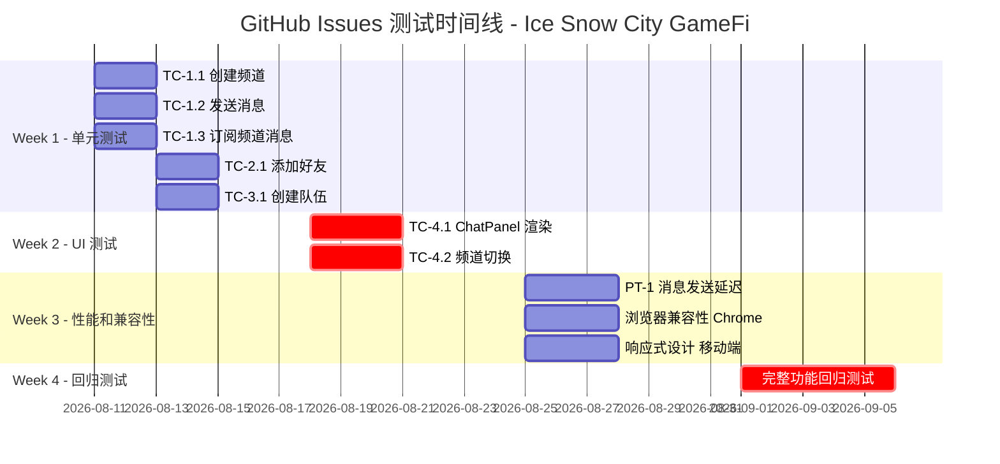
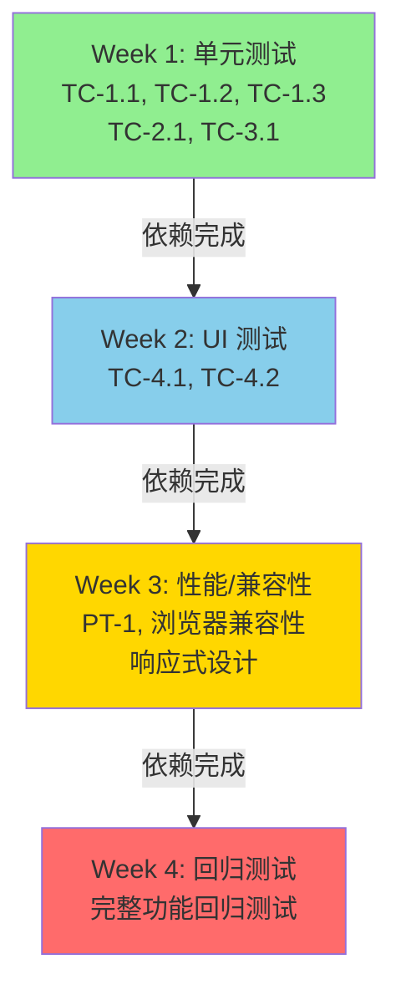

# GitHub Issues 甘特图 - 社交系统测试时间线

## 依赖关系图

## 测试执行计划

### Week 1 (2026-08-11 ~ 2026-08-17) - 单元测试
**目标**: 完成所有 Manager 类和事件系统的单元测试

| Issue | 标题 | 优先级 | 预计工期 | 状态 |
|-------|------|--------|---------|------|
| #1 | TC-1.1 创建频道 | P0 | 2 天 | 待开始 |
| #2 | TC-1.2 发送消息 | P0 | 2 天 | 待开始 |
| #3 | TC-1.3 订阅频道消息 | P0 | 2 天 | 待开始 |
| #4 | TC-2.1 添加好友 | P0 | 2 天 | 待开始 |
| #5 | TC-3.1 创建队伍 | P0 | 2 天 | 待开始 |

**关键成果**: 所有 Manager 类通过单元测试，事件系统验证完成

---

### Week 2 (2026-08-18 ~ 2026-08-24) - UI 测试
**目标**: 完成 React 组件和交互的 UI 测试

| Issue | 标题 | 优先级 | 预计工期 | 依赖 | 状态 |
|-------|------|--------|---------|------|------|
| #6 | TC-4.1 ChatPanel 渲染 | P0 | 3 天 | Week 1 完成 | 待开始 |
| #7 | TC-4.2 频道切换 | P0 | 3 天 | Week 1 完成 | 待开始 |

**关键成果**: ChatPanel 组件通过所有交互测试，频道切换流畅无缺陷

---

### Week 3 (2026-08-25 ~ 2026-08-31) - 性能和兼容性测试
**目标**: 完成性能基准测试和跨浏览器兼容性验证

| Issue | 标题 | 优先级 | 预计工期 | 依赖 | 状态 |
|-------|------|--------|---------|------|------|
| #8 | PT-1 消息发送延迟 | P1 | 3 天 | Week 2 完成 | 待开始 |
| #9 | 浏览器兼容性 - Chrome 120+ | P1 | 3 天 | Week 2 完成 | 待开始 |
| #10 | 响应式设计 - 移动端 | P1 | 3 天 | Week 2 完成 | 待开始 |

**关键成果**: 性能指标达标，主流浏览器兼容性验证完成

---

### Week 4 (2026-09-01 ~ 2026-09-05) - 回归测试
**目标**: 完成完整功能回归测试，确保所有功能正常

| Issue | 标题 | 优先级 | 预计工期 | 依赖 | 状态 |
|-------|------|--------|---------|------|------|
| #11 | 完整功能回归测试 | P0 | 5 天 | 所有前置测试完成 | 待开始 |

**关键成果**: 所有功能验证完成，项目进入发布阶段

---

## 关键路径分析

**关键路径**: Week 1 → Week 2 → Week 3 → Week 4

**总工期**: 4 周 (28 天)

**浮动时间**: 
- Week 1: 0 天 (关键路径)
- Week 2: 0 天 (关键路径)
- Week 3: 0 天 (关键路径)
- Week 4: 0 天 (关键路径)

**风险点**:
1. Week 1 单元测试失败会延迟整个项目
2. Week 2 UI 测试发现的缺陷可能需要回到 Week 1 修复
3. Week 3 性能测试未达标需要优化

---

## 资源分配

| 角色 | Week 1 | Week 2 | Week 3 | Week 4 |
|------|--------|--------|--------|--------|
| 后端开发 | 100% | 20% | 20% | 10% |
| 前端开发 | 20% | 100% | 50% | 50% |
| QA 工程师 | 50% | 50% | 100% | 100% |
| 性能优化 | 0% | 0% | 50% | 20% |

---

## 成功标准

✅ **Week 1**: 所有单元测试通过率 ≥ 95%
✅ **Week 2**: UI 测试覆盖率 ≥ 90%，交互无缺陷
✅ **Week 3**: 性能指标达标，兼容性 100%
✅ **Week 4**: 回归测试通过率 100%

---

## 沟通计划

- **每日站会**: 09:00 (15 分钟)
- **周报**: 每周五 16:00
- **风险评审**: 每周一 10:00
- **结果交付**: 每周末

